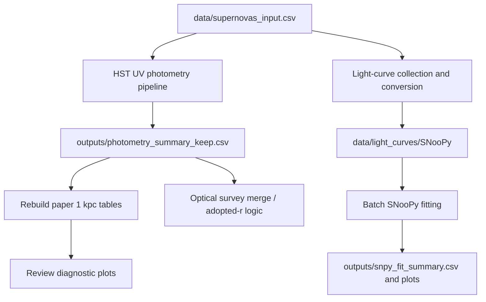

# HST UV Host Photometry And Light-Curve Analysis


This repository now contains the full working analysis environment for the HST UV host-photometry project, not just the original photometry pipeline. In addition to HST and optical host photometry, it includes light-curve ingestion and conversion utilities, SNooPy fitting workflows, plot-review tools, paper-summary table builders, and supporting products used to prepare the current science sample.

## Table Of Contents

- [What This Repo Does](#what-this-repo-does)
- [Current Analysis Flow](#current-analysis-flow)
- [Repository Layout](#repository-layout)
- [Key Inputs](#key-inputs)
- [Main Commands](#main-commands)
- [Main Scripts](#main-scripts)
- [Outputs](#outputs)
- [Notes](#notes)

## What This Repo Does

- Measures local host-galaxy photometry at SN positions using HST/WFC3 UVIS F275W.
- Adds companion optical `r`-band host photometry from survey cutouts such as `LegacySurvey`, `DES`, `PanSTARRS`, and `SkyMapper`.
- Rebuilds paper-facing 1 kpc summary tables from the main photometry products.
- Stores and audits auxiliary optical light curves from `ATLAS`, `ZTF`, and local `SNooPy`-format files.
- Runs batch `SNooPy` fitting and writes fit summaries, saved fit objects, and diagnostic plots.
- Provides review tooling for inspecting photometry plots and flagging paper candidates.

## Current Analysis Flow



A practical way to think about the repo is:

1. Build or update the HST + optical host-photometry products.
2. Rebuild the paper summary tables from the main photometry table.
3. Review diagnostic plots and selected paper candidates.
4. Prepare local light curves and run `SNooPy` fits.

## Repository Layout

```text
HST_UV/
├── README.md
├── PLAN.md
├── scripts/
│   ├── hst_uv_photometry_pipeline.py
│   ├── rebuild_paper_summary_1kpc.py
│   ├── regenerate_diagnostic_plots.py
│   ├── merge_parallel_rband_photometry.py
│   ├── plot_review_app.py
│   ├── run_snpy_dual_model_batch.py
│   ├── convert_*_to_snoopy.py
│   ├── download_* / find_* helpers
│   ├── project_paths.py
│   └── archive/                         # one-off / historical utilities
├── data/
│   ├── supernovas_input.csv
│   ├── fits_to_sn_mapping.csv
│   ├── tns_crossmatch.csv
│   ├── adopted_r_survey_overrides.csv
│   ├── light_curves/                    # ATLAS / ZTF / SNooPy products
│   ├── hst_programs/                    # local HST FITS holdings, ignored by git
│   └── hst_downloads/                   # local download batches, ignored by git
├── filters/                             # filter throughput files used by light-curve work
├── notebooks/
│   └── generate_all_figures.ipynb
├── outputs/
│   ├── photometry_summary_keep.csv
│   ├── sn_flux_and_mag_upperlimits.csv
│   ├── sn_mag_summary_1kpc_full.csv
│   ├── sn_mag_summary_1kpc.csv
│   ├── plots/
│   ├── snpy_plots/
│   ├── snpy_raw_plots/
│   ├── snpy_fits/
│   └── images/                          # local hostphot image products, ignored by git
└── overleaf/                            # local manuscript repo, ignored by git
```

## Key Inputs

The main photometry workflow uses:

- `data/supernovas_input.csv`
  - primary sample table
  - includes SN names, coordinates, redshift, and optional FITS path columns
- `data/fits_to_sn_mapping.csv`
  - fallback mapping from SN name to FITS path when the input table does not specify one
- `data/tns_crossmatch.csv`
  - local crossmatch between HST footprints and TNS public objects
- `data/adopted_r_survey_overrides.csv`
  - manual survey-selection overrides used when rebuilding paper tables

Local-only heavy data live in:

- `data/hst_programs/`
- `data/hst_downloads/`
- `outputs/images/`
- `overleaf/`

These folders are intentionally ignored by git.

## Main Commands

### 1. Run or update HST UV host photometry

```bash
python scripts/hst_uv_photometry_pipeline.py \
  --input-csv data/supernovas_input.csv \
  --mapping-csv data/fits_to_sn_mapping.csv
```

Useful flags:

| Flag | Purpose |
|---|---|
| `--dry-run` | Validate rows, FITS paths, and WCS only |
| `--max-rows N` | Run on the first `N` targets only |
| `--no-plots` | Skip plot generation |
| `--disable-rband` | Skip optical `r`-band host photometry |
| `--rband-only` | Run only the optical `r`-band step |
| `--rband-surveys ...` | Set optical survey priority order |

### 2. Merge survey-specific parallel r-band results

```bash
python scripts/merge_parallel_rband_photometry.py \
  --source-summary <survey_summary.csv> \
  --source-log <survey_log.csv> \
  --main-summary outputs/photometry_summary_keep.csv \
  --main-upper-limits outputs/sn_flux_and_mag_upperlimits.csv \
  --main-log outputs/processing_log.csv \
  --prefix <survey_prefix>
```

### 3. Rebuild paper-facing 1 kpc summary tables

```bash
python scripts/rebuild_paper_summary_1kpc.py \
  --summary outputs/photometry_summary_keep.csv \
  --paper-full outputs/sn_mag_summary_1kpc_full.csv \
  --paper-short outputs/sn_mag_summary_1kpc.csv
```

### 4. Regenerate diagnostic plots from the summary table

```bash
python scripts/regenerate_diagnostic_plots.py \
  --summary outputs/photometry_summary_keep.csv \
  --paper-full outputs/sn_mag_summary_1kpc_full.csv \
  --plots-dir outputs/plots
```

### 5. Review plots interactively

```bash
python scripts/plot_review_app.py \
  --plots-dir outputs/plots \
  --summary outputs/photometry_summary_keep.csv \
  --paper-table outputs/sn_mag_summary_1kpc_full.csv
```

### 6. Run batch SNooPy fitting

```bash
python scripts/run_snpy_dual_model_batch.py \
  --snoopy-dir data/light_curves/SNooPy \
  --input-csv data/supernovas_input.csv \
  --output-csv outputs/snpy_fit_summary.csv
```

## Main Scripts

- `scripts/hst_uv_photometry_pipeline.py`
  - main HST + optical host-photometry pipeline
  - writes the master photometry tables and diagnostic plots
- `scripts/rebuild_paper_summary_1kpc.py`
  - derives the paper-style 1 kpc summary tables from the master summary
- `scripts/regenerate_diagnostic_plots.py`
  - rebuilds the HST-left / optical-right diagnostic figures from existing outputs
- `scripts/plot_review_app.py`
  - small Flask app for stepping through plots and saving review flags
- `scripts/run_snpy_dual_model_batch.py`
  - resumable batch SNooPy fitting over local SNooPy light-curve files
- `scripts/merge_parallel_rband_photometry.py`
  - merges survey-specific parallel photometry back into the main outputs
- `scripts/convert_atlas_to_snoopy.py`
  - converts ATLAS forced photometry into local SNooPy-format files
- `scripts/convert_ztf_forcedphot_to_snoopy.py`
  - converts ZTF forced-photometry products into SNooPy format
- `scripts/convert_ztfcosmo_to_snoopy.py`
  - converts selected ZTFCOSMO products into SNooPy format
- `scripts/convert_sifto_lowz_to_snoopy.py`
  - converts local low-z SIFTO light curves into SNooPy-compatible files
- `scripts/find_hst_f275w_for_snlist.py`
  - searches MAST for HST F275W candidates for the working SN list
- `scripts/download_hst_products_from_csv.py`
  - downloader used for HST product manifests prepared elsewhere in the repo

## Outputs

Core photometry outputs:

- `outputs/photometry_summary_keep.csv`
- `outputs/sn_flux_and_mag_upperlimits.csv`
- `outputs/processing_log.csv`
- `outputs/results.pkl`
- `outputs/plots/*.png`

Paper-summary outputs:

- `outputs/sn_mag_summary_1kpc_full.csv`
- `outputs/sn_mag_summary_1kpc.csv`
- `outputs/paper_plot_candidates.csv`
- `outputs/plot_review_flags*.csv`

SNooPy outputs:

- `outputs/snpy_fit_summary.csv`
- `outputs/snpy_plots/`
- `outputs/snpy_raw_plots/`
- `outputs/snpy_problem_raw_plots/`
- `outputs/snpy_fits/`

## Notes

- The README is meant to describe the current active analysis state, while [PLAN.md](/Users/lluisgalbany/Downloads/HST_UV/PLAN.md) tracks the current project status and next-phase work.
- FITS files are excluded from git through `*.fits` / `*.fit` ignore rules.
- `data/hst_programs/`, `data/hst_downloads/`, `outputs/images/`, and `overleaf/` are local-only and intentionally not pushed.
- The reproducible center of the repo is now the combination of the main photometry summary, the rebuilt paper tables, and the SNooPy fitting outputs.
