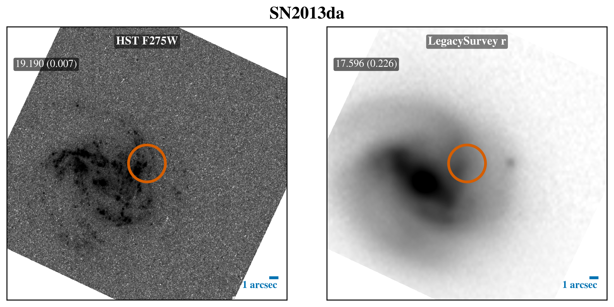
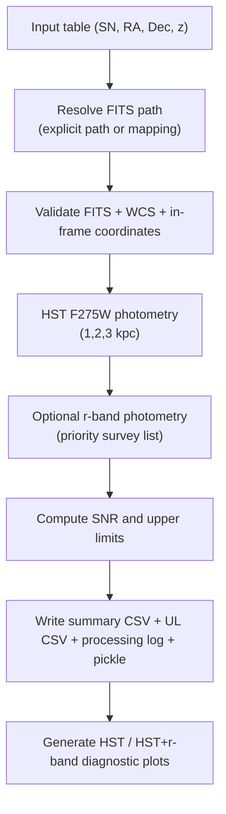

# HST UV Host Photometry Pipeline


End-to-end local pipeline for host-galaxy photometry at SN positions, based on HST/WFC3 UVIS F275W with optional companion r-band photometry from ground-based surveys.

## Table of Contents

- [Highlights](#highlights)
- [Quick Start](#quick-start)
- [Workflow](#workflow)
- [Repository Layout](#repository-layout)
- [Input Tables](#input-tables)
- [Commands](#commands)
- [Outputs](#outputs)
- [Main Scripts](#main-scripts)
- [Citation](#citation)
- [Notes](#notes)

## Highlights

- Validates FITS + celestial WCS coverage for each target position.
- Measures local-aperture photometry at 1, 2, and 3 kpc.
- Selects exactly one r-band survey using a priority list (`LegacySurvey`, `DES`, `PanSTARRS`, `SkyMapper` by default).
- Computes S/N and explicit upper-limit columns from a configurable threshold.
- Produces publication-friendly diagnostic panels and structured CSV outputs.
- Supports resume mode via `outputs/results.pkl`.

## Quick Start

```bash
python -m pip install numpy pandas astropy matplotlib aplpy reproject hostphot
python scripts/hst_uv_photometry_pipeline.py \
  --input-csv data/supernovas_input.csv \
  --mapping-csv data/fits_to_sn_mapping.csv
```

Example plot output:



## Workflow



## Repository Layout

```text
HST_UV/
├── scripts/
│   ├── project_paths.py
│   ├── hst_uv_photometry_pipeline.py
│   ├── run_snpy_dual_model_batch.py
│   ├── rebuild_paper_summary_1kpc.py
│   ├── merge_parallel_rband_photometry.py
│   ├── tns_crossmatch.py
│   └── archive/                  # one-off recovery / migration / sync helpers
├── data/
│   ├── supernovas_input.csv
│   ├── fits_to_sn_mapping.csv
│   ├── tns_crossmatch.csv
│   └── tns_public_objects.csv.zip
│   ├── light_curves/            # ATLAS / SNooPy / ZTF inputs + reports
│   ├── hst_downloads/           # extra HST download batches
│   └── hst_programs/            # preferred home for 16741/, 17179/, ...
├── images/                      # temporary/working image area during runs
├── outputs/
│   ├── images/                  # per-object survey products (moved from images/)
│   ├── plots/                   # diagnostic panel figures
│   ├── photometry_summary_keep.csv
│   ├── sn_flux_and_mag_upperlimits.csv
│   ├── processing_log.csv
│   └── results.pkl
```

## Input Tables

`scripts/hst_uv_photometry_pipeline.py` supports two schemas:

1. Preferred schema in `data/supernovas_input.csv`
- `matched_snname`, `rasn`, `decsn`, `redshift`
- optional FITS columns: `fits_relpath` or `fits_subfolder` + `fits_filename`
  using paths under `data/hst_programs/<program_id>/...` or `data/hst_downloads/...`

2. Alternate schema
- `Supernova`, `RA(H:M:S)`, `DEC(D:M:S)`, `Redshift z`

If a row does not contain an explicit FITS path, the pipeline falls back to `data/fits_to_sn_mapping.csv`.

## Commands

### Optional: rebuild TNS/FITS crossmatch

```bash
python scripts/tns_crossmatch.py \
  --roots data/hst_programs/16741 data/hst_programs/17179 \
  --patterns "*_drc.fits" \
  --tns-csv data/tns_public_objects.csv.zip \
  --output data/tns_crossmatch.csv \
  --only-sne
```

### Main photometry run

```bash
python scripts/hst_uv_photometry_pipeline.py \
  --input-csv data/supernovas_input.csv \
  --mapping-csv data/fits_to_sn_mapping.csv
```

### Useful flags

| Flag | Purpose |
|---|---|
| `--dry-run` | Validate rows/FITS/WCS only; skip photometry outputs |
| `--max-rows N` | Process first `N` rows for tests |
| `--no-plots` | Disable diagnostic plot generation |
| `--disable-rband` | Skip r-band photometry attempts |
| `--rband-surveys ...` | Set r-band survey priority order |
| `--snr-threshold 3.0` | Threshold for upper-limit reporting |

## Outputs

| File | Description |
|---|---|
| `outputs/photometry_summary_keep.csv` | Main result table with measurements, status, S/N, and upper-limit columns |
| `outputs/sn_flux_and_mag_upperlimits.csv` | Upper-limit deliverable table |
| `outputs/processing_log.csv` | Per-target/FITS processing statuses and failure reasons |
| `outputs/results.pkl` | Resume cache of per-FITS result dictionaries |
| `outputs/plots/*.png` | HST-only or HST+r-band diagnostic panels |
| `outputs/images/<object>/<survey>/...` | Per-object photometry artifacts |

## Main Scripts

- `scripts/hst_uv_photometry_pipeline.py`: production pipeline for validation, photometry, S/N and UL derivation, and plotting.
- `scripts/run_snpy_dual_model_batch.py`: resumable SNooPy `max_model` + `EBV_model2` fitting over local SNooPy files.
- `scripts/rebuild_paper_summary_1kpc.py`: rebuild the paper-style 1 kpc summary table from `outputs/photometry_summary_keep.csv`.
- `scripts/merge_parallel_rband_photometry.py`: merge survey-specific parallel optical photometry (`DES`, `PanSTARRS`, `SkyMapper`) into the main outputs.
- `scripts/download_atlas_forcedphot.py`: pull ATLAS forced photometry for selected targets.
- `scripts/convert_atlas_to_snoopy.py`: convert ATLAS forced-photometry files to SNooPy light curves.
- `scripts/convert_ztfcosmo_to_snoopy.py`: convert selected ZTFCOSMO light curves to SNooPy format.
- `scripts/convert_sifto_lowz_to_snoopy.py`: convert low-z `.out_<filter>` light-curve folders into SNooPy format.
- `scripts/find_hst_f275w_for_snlist.py`: search MAST for new HST/F275W candidates from an external SN list.
- `scripts/download_hst_products_from_csv.py`: generic MAST HST product downloader used by the search/recovery workflow.
- `scripts/tns_crossmatch.py`: local cone-search crossmatch between FITS footprints and TNS public objects.

## Citation

If this workflow is used in scientific results, cite:

- the repository itself (URL + commit hash used in analysis),
- `hostphot`,
- relevant HST data products and survey data sources used for r-band comparison.

## Notes

- FITS files are intentionally excluded from version control (`*.fits`/`*.fit` in `.gitignore`).
- Helper scripts now default to `data/light_curves/` and repository-relative paths instead of machine-specific absolute paths.
- Keep raw FITS locally under `data/hst_programs/<program_id>/` and archive-download FITS under `data/hst_downloads/`.
- The additional F275W batch now lives at `data/hst_downloads/additional_f275w_bestexptime/`.
- One-off recovery, migration, backup, sync, and audit helpers were moved to `scripts/archive/` so the top-level `scripts/` directory stays focused on the reproducible analysis path.
